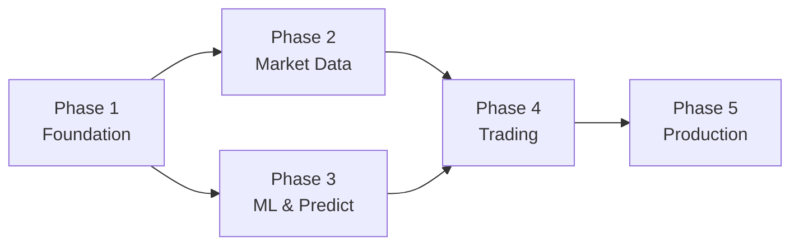

# 📋 Kế Hoạch Triển Khai FastAPI — AutoTrader

> **Dự án**: MTF Trend Predictor (LSTM Dual-Timeframe + Auto Trading)  
> **Ngày tạo**: 2026-05-20  
> **Trạng thái hiện tại**: FastAPI đã bootstrap cơ bản, chỉ có 1 endpoint `/health`

---

## 📊 Tổng Quan Hiện Trạng

### Đã có ✅
| Thành phần | File | Ghi chú |
|---|---|---|
| FastAPI app + lifespan | `src/main.py` | Khởi tạo DB engine, logging |
| API Router (skeleton) | `src/apps/api/router.py` | Chỉ có `/api/v1/health` |
| Settings (Pydantic-free) | `src/core/settings.py` | Dataclass + `.env` |
| Async DB session | `src/infrastructure/db/session.py` | SQLAlchemy async + asyncpg |
| ORM Models (5 bảng) | `src/infrastructure/db/models/` | Candle, Trade, Prediction, ModelVersion, BacktestRun |
| Alembic migrations | `alembic/` | 1 migration `init_database` |
| Business modules | `src/modules/` | ml, trading, market_data, backtesting, feature_engineering, monitoring |
| Streamlit Dashboard | `src/apps/dashboard/app.py` | UI đầy đủ (~1100 dòng) |

### Chưa có ❌
- Pydantic schemas (request/response validation)
- CRUD repositories (data access layer)
- API endpoints cho business logic
- Dependency injection pattern
- Error handling middleware
- CORS configuration
- WebSocket cho realtime data
- Background tasks

---

## 🔑 Giải Thích Các Khái Niệm Chính

### 1. `dependencies.py` — Dependency Injection là gì?

> [!NOTE]
> **Alembic** quản lý **cấu trúc bảng** (tạo bảng, thêm cột, migration).  
> **Dependencies** quản lý **kết nối database cho mỗi request API**.

Khi một endpoint API cần đọc/ghi database, nó cần một **session** (phiên kết nối). File `dependencies.py` cung cấp session đó theo pattern của FastAPI:

```python
# Không có dependencies.py — phải tự tạo session trong mỗi endpoint:
@router.get("/candles")
async def get_candles():
    factory = get_session_factory()
    async with factory() as session:  # Lặp lại code này ở MỌI endpoint
        result = await session.execute(...)
        return result

# Có dependencies.py — FastAPI tự động inject session:
@router.get("/candles")
async def get_candles(db: AsyncSession = Depends(get_db)):
    result = await db.execute(...)  # Sạch hơn, không lặp code
    return result
```

**Tóm lại**: `dependencies.py` giúp tái sử dụng session factory đã có trong `session.py`, nhưng theo cách mà FastAPI hiểu và tự động quản lý vòng đời (mở/đóng) session cho mỗi request.

---

### 2. `repositories/` — Data Access Layer là gì?

> [!NOTE]
> Repository = **lớp trung gian** giữa API endpoint và database.

**Không có repository** — logic SQL nằm trực tiếp trong endpoint:
```python
@router.get("/candles")
async def get_candles(db = Depends(get_db)):
    # SQL logic lẫn với API logic — khó bảo trì khi project lớn
    stmt = select(Candle).where(Candle.symbol == "XAUUSD").order_by(Candle.time.desc()).limit(100)
    result = await db.execute(stmt)
    return result.scalars().all()
```

**Có repository** — tách riêng phần truy vấn DB:
```python
# repositories/candle_repo.py
class CandleRepository:
    async def list_by_symbol(self, symbol, limit) -> list[Candle]:
        stmt = select(Candle).where(Candle.symbol == symbol).order_by(...)
        ...

# endpoints/market_data.py — sạch gọn
@router.get("/candles")
async def get_candles(db = Depends(get_db)):
    repo = CandleRepository(db)
    return await repo.list_by_symbol("XAUUSD", limit=100)
```

**Lợi ích**: Khi cần thay đổi query SQL, chỉ sửa 1 chỗ (repository), không phải tìm lại trong hàng chục endpoints. Dashboard Streamlit cũng có thể tái sử dụng repository thay vì viết lại SQL.

---

### 3. Pydantic Schemas — Validation tự động là gì?

> [!NOTE]
> Pydantic Schemas = **bộ lọc & kiểm tra dữ liệu** tự động cho API request/response.

**Vấn đề khi không có schema**: Ai đó gọi API gửi data sai format → app crash hoặc ghi data rác vào DB.

**Có schema**: FastAPI tự động kiểm tra data trước khi code chạy:

```python
# Schema định nghĩa "data hợp lệ phải trông như thế nào"
class CrawlRequest(BaseModel):
    symbol: str = "XAUUSD"                    # Bắt buộc là string
    timeframes: list[str]                      # Bắt buộc là danh sách
    start_date: date                           # Bắt buộc là ngày hợp lệ
    end_date: date                             # Bắt buộc là ngày hợp lệ

# FastAPI tự động:
# 1. Kiểm tra request body có đủ fields không
# 2. Kiểm tra kiểu dữ liệu (gửi số thay vì ngày → báo lỗi 422)
# 3. Convert data sang đúng type (string "2026-01-01" → date object)
@router.post("/crawl")
async def crawl_data(req: CrawlRequest):   # ← Tự validate
    ...  # Chắc chắn req.start_date là date hợp lệ
```

**Response schema** giúp API trả data đồng nhất — client (frontend/mobile) luôn biết chính xác data trả về có format gì.

Ngoài ra, Pydantic schema tự động sinh ra **API docs** (Swagger UI tại `/docs`) — minh họa rõ ràng mỗi endpoint cần gửi gì, nhận gì.

---

## 🏗️ Kiến Trúc Mục Tiêu

```
src/
├── main.py                          # FastAPI bootstrap (đã có, sẽ thêm CORS + error handler)
├── core/
│   ├── settings.py                  # Settings (đã có)
│   ├── constants.py                 # Constants (đã có)
│   ├── errors.py                    # Exceptions (đã có, sẽ mở rộng)
│   ├── logging.py                   # Logging (đã có)
│   └── dependencies.py              # ⭐ NEW — Inject DB session cho endpoints
├── apps/
│   ├── api/
│   │   ├── router.py                # Top-level router (đã có, sẽ gắn thêm sub-routers)
│   │   ├── schemas/                 # ⭐ NEW — Pydantic: validate request/response
│   │   │   ├── __init__.py
│   │   │   ├── common.py            # Pagination, health, error responses
│   │   │   ├── candle.py            # Candle request/response
│   │   │   ├── trade.py             # Trade schemas
│   │   │   ├── prediction.py        # Prediction schemas
│   │   │   └── model.py             # Model version schemas
│   │   └── endpoints/               # ⭐ NEW — Route handlers (business logic)
│   │       ├── __init__.py
│   │       ├── market_data.py       # /crawl, /import
│   │       ├── predictions.py       # /predict, /predictions
│   │       ├── trading.py           # /trades, /mt5/*
│   │       ├── models.py            # /models, /train
│   │       └── system.py            # /health, /config
│   └── dashboard/                   # Streamlit (giữ nguyên, không đổi)
├── infrastructure/
│   ├── db/
│   │   ├── session.py               # DB session (đã có)
│   │   ├── base.py                  # Base model (đã có)
│   │   ├── models/                  # ORM models (đã có)
│   │   └── repositories/            # ⭐ NEW — Tách riêng logic truy vấn DB
│   │       ├── __init__.py
│   │       ├── base.py              # Generic async CRUD
│   │       ├── candle_repo.py
│   │       ├── trade_repo.py
│   │       ├── prediction_repo.py
│   │       └── model_repo.py
│   └── middleware/                   # ⭐ NEW
│       ├── __init__.py
│       ├── error_handler.py         # Catch exceptions → trả JSON lỗi chuẩn
│       └── cors.py                  # Cho phép Streamlit gọi API
└── modules/                         # Business logic (đã có, giữ nguyên)
```

---

## 🚀 Các Giai Đoạn Triển Khai

### Phase 1: Nền Tảng & Cơ Sở Hạ Tầng
> **Mục tiêu**: Xây dựng tầng foundation — DI, schemas, repositories, middleware  
> **Thời gian dự kiến**: 1–2 ngày

#### 1.1 Dependencies & Middleware

**File**: `src/core/dependencies.py`
```python
# Cung cấp DB session cho mỗi API request qua FastAPI Depends()
async def get_db() -> AsyncIterator[AsyncSession]:
    # Tái sử dụng session factory từ src/infrastructure/db/session.py
    ...
```

**File**: `src/infrastructure/middleware/error_handler.py`
```python
# Catch AppError → trả JSON chuẩn { "error": ..., "detail": ... }
# Catch 422 Validation → format lại response cho dễ đọc
```

**File**: `src/infrastructure/middleware/cors.py`
```python
# Cho phép Streamlit Dashboard gọi API (localhost:8501 → localhost:8000)
```

**Sửa**: `src/main.py`
```python
# Thêm CORS middleware
# Thêm global exception handler
```

#### 1.2 Pydantic Schemas

**File**: `src/apps/api/schemas/common.py`
```python
class PaginationParams(BaseModel):
    page: int = 1
    size: int = 50

class PaginatedResponse(BaseModel, Generic[T]):
    items: list[T]
    total: int
    page: int
    size: int

class ErrorResponse(BaseModel):
    error: str
    detail: str | None

class HealthResponse(BaseModel):
    status: str
    service: str
    environment: str
    version: str
    database: str  # "connected" | "disconnected"
```

**File**: `src/apps/api/schemas/candle.py`
```python
class CandleOut(BaseModel):          # Response — format candle trả về client
class CrawlRequest(BaseModel):      # POST body: symbol, timeframes[], start, end
class CrawlResponse(BaseModel):     # Kết quả crawl: số nến, file path
class ImportRequest(BaseModel):     # Upload CSV file
```

**File**: `src/apps/api/schemas/trade.py`
```python
class TradeOut(BaseModel):           # Response — trade history item
class TradeFilter(BaseModel):       # Query params: symbol, status, date range
class ExecuteTradeRequest(BaseModel): # Manual trade: signal, confidence
```

**File**: `src/apps/api/schemas/prediction.py`
```python
class PredictionOut(BaseModel):      # Prediction history item
class PredictRequest(BaseModel):    # model_mode, symbol
class PredictResponse(BaseModel):   # H1, M5, combined signal
```

**File**: `src/apps/api/schemas/model.py`
```python
class ModelVersionOut(BaseModel):    # Model info + metrics
class TrainRequest(BaseModel):      # timeframe, data_file, epochs, batch_size, lookback
class TrainResponse(BaseModel):     # metrics, model path
```

#### 1.3 Base Repository

**File**: `src/infrastructure/db/repositories/base.py`
```python
class BaseRepository(Generic[ModelT]):
    def __init__(self, session: AsyncSession, model: type[ModelT]): ...
    async def get_by_id(self, id: int) -> ModelT | None: ...
    async def list(self, offset, limit, **filters) -> tuple[list[ModelT], int]: ...
    async def create(self, **kwargs) -> ModelT: ...
    async def update(self, id: int, **kwargs) -> ModelT: ...
    async def delete(self, id: int) -> bool: ...
```

#### Checklist Phase 1
- [ ] Tạo `src/core/dependencies.py`
- [ ] Tạo `src/infrastructure/middleware/error_handler.py`
- [ ] Tạo `src/infrastructure/middleware/cors.py`
- [ ] Tạo tất cả schema files trong `src/apps/api/schemas/`
- [ ] Tạo `src/infrastructure/db/repositories/base.py`
- [ ] Cập nhật `src/main.py` (CORS, error handler)
- [ ] Cập nhật `requirements.txt` thêm `pydantic>=2.0`

---

### Phase 2: API Market Data
> **Mục tiêu**: 2 chức năng chính — crawl data mới từ MT5 + import data từ CSV  
> **Thời gian dự kiến**: 1 ngày

#### Endpoints

| Method | Path | Mô tả |
|--------|------|-------|
| `POST` | `/api/v1/market-data/crawl` | Crawl data mới từ MT5 (background task) |
| `POST` | `/api/v1/market-data/import` | Import candles từ file CSV vào database |
| `GET` | `/api/v1/market-data/files` | Liệt kê CSV files hiện có trong project |

#### Files cần tạo
- [ ] `src/infrastructure/db/repositories/candle_repo.py`
- [ ] `src/apps/api/endpoints/market_data.py`

#### Ghi chú kỹ thuật
- Crawl MT5 chạy synchronous (MetaTrader5 lib không async) → dùng `BackgroundTasks` hoặc `run_in_executor`
- Import CSV sử dụng bulk insert (`session.execute(insert(...).values(records))`)

---

### Phase 3: API ML & Prediction
> **Mục tiêu**: Train models, predict, quản lý model versions  
> **Thời gian dự kiến**: 1–2 ngày

#### Endpoints

| Method | Path | Mô tả |
|--------|------|-------|
| `POST` | `/api/v1/models/train` | Huấn luyện model (background task) |
| `GET` | `/api/v1/models` | Danh sách model versions |
| `GET` | `/api/v1/models/{id}` | Chi tiết model + metrics |
| `PATCH` | `/api/v1/models/{id}/activate` | Set model active |
| `POST` | `/api/v1/predictions/predict` | Dự đoán realtime |
| `GET` | `/api/v1/predictions` | Lịch sử predictions |

#### Files cần tạo
- [ ] `src/infrastructure/db/repositories/model_repo.py`
- [ ] `src/infrastructure/db/repositories/prediction_repo.py`
- [ ] `src/apps/api/endpoints/models.py`
- [ ] `src/apps/api/endpoints/predictions.py`

#### Ghi chú kỹ thuật
- Training chạy lâu → **phải** dùng Background Task, trả về `202 Accepted` + task ID
- Predict gọi `Trainer.predict()` — cần load model vào memory khi app startup
- Cân nhắc thêm WebSocket `/ws/predictions` cho streaming realtime

---

### Phase 4: API Trading (MT5)
> **Mục tiêu**: Quản lý kết nối MT5, trade execution, trade history  
> **Thời gian dự kiến**: 1–2 ngày

#### Endpoints

| Method | Path | Mô tả |
|--------|------|-------|
| `POST` | `/api/v1/mt5/connect` | Kết nối MT5 |
| `POST` | `/api/v1/mt5/disconnect` | Ngắt kết nối |
| `GET` | `/api/v1/mt5/status` | Trạng thái kết nối + account info |
| `GET` | `/api/v1/mt5/positions` | Lệnh đang mở |
| `POST` | `/api/v1/trading/execute` | Vào lệnh thủ công |
| `POST` | `/api/v1/trading/auto/start` | Bật auto trading |
| `POST` | `/api/v1/trading/auto/stop` | Tắt auto trading |
| `GET` | `/api/v1/trading/auto/status` | Trạng thái bot |
| `GET` | `/api/v1/trades` | Lịch sử trades |
| `GET` | `/api/v1/trades/{id}` | Chi tiết trade |

#### Files cần tạo
- [ ] `src/infrastructure/db/repositories/trade_repo.py`
- [ ] `src/apps/api/endpoints/trading.py`

#### Ghi chú kỹ thuật
- MT5Trader instance cần là **singleton** — lưu trong `app.state` hoặc module-level
- Auto trading thread đã có sẵn trong `mt5_trader.py` → chỉ cần wrap API
- Cân nhắc WebSocket `/ws/trades` cho trade log stream

---

### Phase 5: Production Polish
> **Mục tiêu**: Hoàn thiện cho production  
> **Thời gian dự kiến**: 1–2 ngày

#### Danh sách công việc
- [ ] **WebSocket**: Realtime predictions + trade log streaming
- [ ] **Background Tasks**: Xem xét Celery/ARQ cho long-running jobs (training)
- [ ] **API Documentation**: Tùy chỉnh Swagger UI (`/docs`) + ReDoc (`/redoc`)
- [ ] **Docker**: Dockerfile + docker-compose (app + postgres)
- [ ] **Cập nhật README**: Thêm hướng dẫn API, endpoint list

#### Dependencies bổ sung
```
pydantic>=2.0,<3
python-multipart>=0.0.9    # File upload (import CSV)
```

---

## 📌 Thứ Tự Ưu Tiên



> **Khuyến nghị**: Phase 1 → 2 → 3 tuần tự. Phase 4 sau khi 2+3 xong. Phase 5 cuối cùng.

---

## ⚠️ Lưu Ý Quan Trọng

1. **MetaTrader5 lib là synchronous** — các endpoint gọi MT5 cần `run_in_executor` hoặc background thread
2. **TensorFlow model loading** chiếm nhiều RAM — cần load 1 lần ở startup, tránh load mỗi request
3. **Streamlit Dashboard vẫn giữ nguyên** — chạy song song cổng 8501, gọi trực tiếp modules (không qua API)
4. **Database đã async** (asyncpg) — phù hợp hoàn toàn với FastAPI async endpoints
5. **Alembic migrations** — mỗi khi thêm/sửa ORM model, tạo migration mới bằng `alembic revision --autogenerate`
